  
  <h1>Hello, I'm Rex</h1>
  
  <em>I like to code sometimes</em>
  
 &nbsp;&nbsp;&nbsp;&nbsp;
  
  &nbsp;&nbsp;&nbsp;&nbsp;
  
  &nbsp;&nbsp;&nbsp;&nbsp;
  

  
<h2>Stats</h2>

<table>
  <tr>
    <td>
    
  
    </td>
    <td>
  
    </td>
  </tr>
</table>

